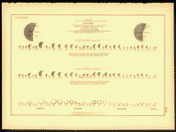

This is the chart that we are discussing:

, [high resolution chart](https://www.loc.gov/resource/g3701gm.gct00008/?sp=104)

- Fred H. Wines was the  Secretary of the Illinois State Board of Charities. It seems that he had a personal interest in this aspect of the census records. 

- At the top left of the chart a scale is given (just as in a geographic map): 1 square inch corresponds to 4,800 individuals. Obviously graphs now can be re-scaled, so it would be great to include a visual scale as well.

- Each of the state circles shows the number of blind individuals in each state. This number should be highly correlated with the actual population - so it might be more informative to also show the proportion of blind compared to the overall population. Presumably there a case could be made to get a proportion of state funding for the blind plus some extra allocation in case the proportion of the blind is higher than in other states. 

- The whole interpretation of this chart is confounded by the missing comparison to the overall population. At face value, there are more blind men than blind women.  Does that mean that the proportion of men affected by blindness is also higher or is this a reflection of the gender balance at the time? 

- donut rings: the inner ring is the 1860 data, the outer ring is the data from 1870. These chart only work, if there is an increase in the number of blind individuals in every single state. The U.S. was growing at a fast pace during this time (growing from about 31.2 million people in 1860  to 38.5 million people in 1870), and as long as living conditions and health care conditions did not improve, we would expect proportionally about the same  increase in the blind population.  

- link to [current statistics](https://nfb.org/blindness-statistics)

- data for Colorado (state since August 1, 1876; territory since February 28, 1861) and Nevada (state since October 31, 1864) is missing.

- pros for the angles: they are not affected by the overall number, but con: comparing angles (with different starting points) is cognitively a hard task (Celveland & McGill reference).

- con against angles: the cumulative angles introduce dependencies

- earliest pie chart is credited to Statistical Breviary (William Playfair, 1801)

- other sources critiquing pie charts

   - [Save the Pies for Dessert (Stephen Few)](http://www.perceptualedge.com/articles/08-21-07.pdf) Pro: shows part-to-whole relationships, better than bar charts at quarter percentage marks (0%,25%,50%,75%,or 100%) Con: Pie charts often worse than bar charts for other percentage differences. "[William Cleaveland] refers to pie charts as 'pop charts' because they are commonly found in pop culture media, but much less in science and technology media."
  
   - The Visual Display of Quantitative Information (Tufte, 2001, p 178) "A table is nearly always better than a dumb pie chart; the only worse design then a pie chart is several of them, for then the viewer is asked to compare  quantities located in spatial disarray both within and between pies"
  
- Did we want to comment on technology 1870's vs 2016 when creating graphics? Have we lost anything from that time?

   - now it is difficult to importing handwriting as a particular font for a pie chart. (I've heard mixed reactions on if handwritten text on graphics looks unprofessional or more artistic)
  
   - Placing "United States" across the entire pie chart. Placing "(Colored, including Indian and Chinese)" across two slices of the pie. Still possible by specifying xy-coordinates but not as straightforward as writing it on the chart.
  
  - An interactive display of a pie chart, might have the division across all of the United States as an opening graphic. User clicks on a particular slice to see pie chart of that particular slice and continue to zoom in. Still not as good as bar chart to quickly get a sense of the divisions across all states.
  
- Does part of the appeal of pie charts vs bar chart have to do with rounded corners vs straight edge?

  - [Why round corners are easier on the eyes](http://uxmovement.com/thinking/why-rounded-corners-are-easier-on-the-eyes/) Curved lines seem more organic. Does that mean a graphic that has too many straight lines seems unreal or unsettling? Is that why hand-drawn seems appealing? Is there an uncanny valley for statistical graphics? However adding a randomization to the lines may be adjusting the data...
   
## Approach to re-do the chart

###The data 

Getting the data turns out to be a bit problematic. What we would like are state-level aggregates of the population size and the number of blind individuals by state, gender, nativity and race for both the 1870 census and the 1860 census (for the comparisons).

There are a few avenues available:

- individual data is available from a lot of sites (such as ancestry.com, FamilySearch, etc): e.g. in the 1870 census there are  391 individuals listed by the name of Helen Keller, who are white females (obviously not THE Helen Keller, because she was not born until 1880).

- state aggregate data  as part of the Historical Census Browser  provided by the University of Virginia at [http://mapserver.lib.virginia.edu/](http://mapserver.lib.virginia.edu/). Citation: (2004). Historical Census Browser. Retrieved [Date you accessed source], from the University of Virginia, Geospatial and Statistical Data Center: http://mapserver.lib.virginia.edu/.
The data comes from [ICPSR,  Inter-university Consortium for Political and Social Research](http://www.icpsr.umich.edu/icpsrweb/ICPSR/studies/0003). Unfortunately, only political and economic factors are included in these data sources, but no information on disabilities, i.e. the number of blind or deaf individuals is absent.

- [ipums USA](https://usa.ipums.org/usa/) provides access to microsamples of all US census. However, microsamples of 1.2% for the 1860 and 1870 census include only a handful of blind individuals for each of the state, and  therefore do not provide a reliable estimate of these proportions.

###The new chart
- States are sorted according to proportions of native/foreign born individuals.
- Some things we didn't see before (unless looking very closely):
    + the proportion of blind individuals among foreigners is high for states that have been founded within the last two decades before the census was taken (such as WI 1848, ... IA 1846). However, this is not consistent - states along the East Coast, particularly New York, are traditional immigration states with large percentages of foreign born population. On the other hand, Kansas and West Virginia became states in 1861 and 1863, respectively, and the percentages of foreign born population are at below 10% in these two states, which is well below the national level of foreign born population of 16% in 1870. Again, these percentages are much more likely a reflection of state level demographics rather than characteristics of the state-level population of blind individuals. 
    + Generally, the number of blind men is higher than the number of blind women in all states, but there are some states that show a huge gender imbalance between blind individuals:  Delaware is the only state, in which the population of blind females is much higher than the male population. Oregon, Vermont, Maine, Virginia, and to a lesser degree, Mississippi, show a (significantly?) markedly higher percentage of blind men than women.
    
```{r, echo=FALSE, fig.width=9, fig.height=6, message=FALSE}
blindprop <- read.csv("data/blind-per.state.csv", na.strings="#VALUE!")
library(ggplot2)
#qplot(reorder(State,  Female.blind.perc), Female.blind.perc, data=blindprop) + coord_flip()

library(tidyr)
library(dplyr)
blind <- blindprop %>% select(State, Male.native.blind.perc, Male.foreign.blind.perc, Female.native.blind.perc, Female.foreign.blind.perc) %>% gather(gender.born, blind, -State)

blind$gender <- "Male"
blind$gender[grep("Female", blind$gender.born)] <- "Female"

blind$nativity <- "Foreign"
blind$nativity[grep("native", blind$gender.born)] <- "Native"

library(RColorBrewer)
cols <- brewer.pal(n=8, name="Paired")

blind$gender.born <- with(blind, interaction(gender, nativity, sep="/"))
blind$gender.born <- factor(blind$gender.born, levels=c("Female/Native", "Female/Foreign", "Male/Foreign", "Male/Native"))
blind$State <- reorder(blind$State, blind$blind, function(x) x[1]+x[3])

ggplot(data=blind, aes(x=State, weight=blind, fill=gender.born)) +
  geom_bar() + 
  coord_flip() + 
  scale_fill_manual("Gender/Nativity", values=cols[c(6,5,1,2)]) +
  theme(legend.position="bottom") +
  ylab("Percentage")
```


## Expected versus observed proportions of blind individuals

### State-wide aggregates
As a follow-up to the state-wide proportions of blind individuals by gender and nativity, we can calculate the proportions of all individuals, regardless of disabilities, and calculate the ratios of gender by nativity for the overall population. Using the marginal distributions for gender and nativity for each state, we calculate an expected percentage.  

```{r, echo=FALSE, fig.width=9, fig.height=6, message=FALSE}
census1870 <- read.csv("data/states-1870.csv", stringsAsFactors = FALSE)
names(census1870)[1] <- "STATE"
foreigners <- census1870[, c("STATE", "FOREIGN.BORN.PERSONS", "NATIVE.BORN.PERSONS", "TOTAL.POPULATION")]
genders <- census1870[, c("STATE", "TOTAL.FEMALES", "TOTAL.MALES", "TOTAL.POPULATION")]

foreigners.all <- foreigners %>% gather(NATIVITY, number, -c(STATE, TOTAL.POPULATION ))
foreigners.all$NATIVITY <- gsub(".BORN.PERSONS", "", foreigners.all$NATIVITY)
foreigners.all$NATIVITYperc <- with(foreigners.all, number/TOTAL.POPULATION*100)

genders.all <- genders %>% gather(GENDER, number, -c(STATE, TOTAL.POPULATION ))
genders.all$GENDER <- gsub("TOTAL.", "", genders.all$GENDER)
genders.all$GENDERperc <- with(genders.all, number/TOTAL.POPULATION*100)


capwords <- function(s, strict = FALSE) {
    cap <- function(s) paste(toupper(substring(s, 1, 1)),
                  {s <- substring(s, 2); if(strict) tolower(s) else s},
                             sep = "", collapse = " " )
    sapply(strsplit(s, split = " "), cap, USE.NAMES = !is.null(names(s)))
}

genders.all$GENDER <- capwords(genders.all$GENDER, strict=TRUE)
genders.all$GENDER <- gsub("s$", "", genders.all$GENDER)

foreigners.all$NATIVITY <- capwords(foreigners.all$NATIVITY, strict=TRUE)

blind.plus <- merge(blind, foreigners.all[,c("STATE", "NATIVITY", "NATIVITYperc")], by.x=c("State", "nativity"), by.y=c("STATE", "NATIVITY"))

blind.plus <- merge(blind.plus, genders.all[,c("STATE", "GENDER", "GENDERperc")], by.x=c("State", "gender"), by.y=c("STATE", "GENDER"))

blind.plus$blind.exp <- with(blind.plus, NATIVITYperc*GENDERperc/100)
blind.plus$blind.resid <- with(blind.plus, (blind-blind.exp)/blind.exp)

blind.plus.fem <- blind.plus %>% group_by(State, gender) %>% summarize(
  blind.exp = sum(blind.exp)
)
ggplot(data=blind, aes(x=State, weight=blind, fill=gender.born)) +
  geom_bar() + 
  coord_flip() + 
  scale_fill_manual("Gender/Nativity", values=cols[c(6,5,1,2)]) +
  theme(legend.position="bottom") +
  ylab("Percentage") + 
  geom_point(aes(y=blind.exp), data=subset(blind.plus, gender.born=="Female/Native"), colour=cols[6], show.legend=FALSE) +
  geom_point(aes(y=blind.exp), data=subset(blind.plus, gender.born=="Female/Native"), colour="white", shape=1, show.legend=FALSE) + 
  geom_point(aes(y=100-blind.exp), data=subset(blind.plus, gender.born=="Male/Native"), colour=cols[2], show.legend=FALSE) +
  geom_point(aes(y=100-blind.exp), data=subset(blind.plus, gender.born=="Male/Native"), colour="white", shape=1, show.legend=FALSE) +
  geom_point(aes(x= State, y=blind.exp), data=subset(blind.plus.fem, gender=="Female"), shape="|", show.legend=FALSE, inherit.aes=FALSE, colour="white", size=3)
```

The dots and the white vertical line segment shows the number of expected blind individuals in each of the four classes of nativity and gender, assuming that the proportion of blind individuals follows the  distribution of the overall population, and that there is no interaction between gender and nativity for any of the states. Except for a few deviations, this latter assumption generally holds well (Oregon is an exception: here, there are fewer women than expected).

### 1% microsample
The chart below shows the actual proportions of blind individuals by gender and nativity for each state in 1870. The dots are showing expected proportions based on the 1.2% microsample for the 1870 census. The expected proportions are based on the assumption that gender and nativity demographics of each state are the same for blind individuals as for the total population.
There are obvious differences:

- Generally, we can see that with a few notable exceptions (Delaware, Rhode Island; Vermont, Connecticut, Louisiana, New Hampshire, Maine, Alabama, Mississippi), the proportions of native born blind men are following the expectation.  

```{r, echo=FALSE, fig.width=9, fig.height=6, message=FALSE, warning=FALSE}
ipums <- read.csv("data/ipums-1870.csv")
gborn <- as.data.frame(xtabs(data=ipums, ~STATEICP+SEX+I(NATIVITY=="Foreign born")))
gborn$State <- toupper(gborn$STATEICP)
names(gborn)[3] <- "nativity"
levels(gborn$nativity) <- c("Native", "Foreign")
gborn<- gborn %>% group_by(State) %>% mutate(totals=sum(Freq))
gborn$blind.exp <- with(gborn, Freq/totals*100)

blind.plus2 <- merge(blind, gborn[, c("State", "SEX","nativity", "blind.exp")], by.x=c("State","gender", "nativity"), by.y=c("State", "SEX", "nativity"), all.x=TRUE)
blind.plus2.fem <- blind.plus2 %>% group_by(State, gender) %>% summarize(
  blind.exp = sum(blind.exp)
)

ggplot(data=blind.plus2, aes(x=State, weight=blind, fill=gender.born)) +
  geom_bar() + 
  coord_flip() + 
  scale_fill_manual("Gender/Nativity", values=cols[c(6,5,1,2)]) +
  theme(legend.position="bottom") +
  ylab("Percentage") + 
  geom_point(aes(y=blind.exp), data=subset(blind.plus2, gender=="Female" & nativity=="Native"),  colour=cols[6], show.legend=FALSE) +
  geom_point(aes(y=blind.exp), subset(blind.plus2, gender=="Female" & nativity=="Native"), colour="white", shape=1, show.legend=FALSE) +
    geom_point(aes(y=100-blind.exp), data=subset(blind.plus2, gender=="Male" & nativity=="Native"), colour=cols[2], show.legend=FALSE) +
  geom_point(aes(y=100-blind.exp), subset(blind.plus2, gender=="Male" & nativity=="Native"), colour="white", shape=1, show.legend=FALSE) +
  geom_point(aes(x= State, y=blind.exp), data=subset(blind.plus2.fem, gender=="Female"), shape="|", show.legend=FALSE, inherit.aes=FALSE, colour="white", size=3)
```
